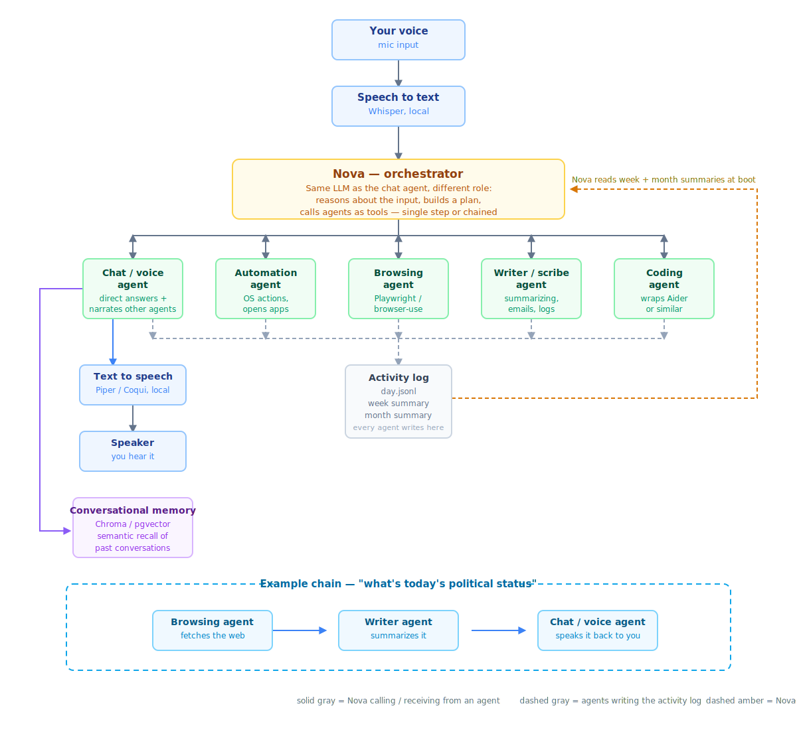

# Nova

Nova is a local-first, multi-agent AI assistant — a single orchestrator that reasons about what you need and delegates to specialized agents for chat, automation, web browsing, coding, and writing. Everything runs on your own machine. No cloud backend, no accounts, no data leaving your computer.

This is a solo, learning-driven passion project — not a polished product. Progress and setbacks are being documented as it's built.



## Why Nova is built this way

Most "AI assistant" projects either wrap a single chat model with a nice UI, or lean entirely on a hosted cloud API. Nova is deliberately different on two counts:

- **Local-only, by design, not by limitation.** Every agent runs on your own hardware. This means no per-request cost, no data ever leaving your machine, and no dependency on an internet connection for most tasks — at the cost of needing a reasonably capable GPU and not scaling to multiple users. That trade-off is intentional.
- **Hierarchical memory instead of a single flat log.** Nova keeps a day-level activity log, which gets compressed into a week-level summary, which gets compressed into a month-level summary. This keeps Nova's context read bounded and fast even after months of use, rather than re-reading an ever-growing raw log on every boot.

## Architecture

Nova's own reasoning (the orchestrator) and the chat agent's conversation both run on the same underlying model, just with different system prompts and roles. The orchestrator plans — deciding whether a request needs a direct answer, a single agent, or a chain of agents — and hands off execution accordingly.

| Component | Role |
|---|---|
| **Nova (orchestrator)** | Reasons about input, builds a plan, calls agents as tools |
| **Chat / voice agent** | Direct Q&A, and narrates what other agents did |
| **Automation agent** | OS-level actions — opening apps, voice-triggered commands |
| **Browsing agent** | Fetches and navigates the web |
| **Writer / scribe agent** | Summarization, email drafting, activity log compression |
| **Coding agent** | Code editing and generation, wraps existing tooling |
| **Activity log** | Day → week → month hierarchical memory of what Nova has done |
| **Conversational memory** | Vector-based semantic recall for the chat agent |

Full diagram: [`docs/nova-architecture.svg`](docs/nova-architecture.svg)

## Status

Actively being built, evenings and weekends. This section will be kept honest as things progress — no claiming something works before it does.

- [x] Chat agent — text-only, with persona and conversational memory
- [x] Voice I/O (STT/TTS)
- [ ] Nova orchestrator — routing and planning
- [ ] Automation agent
- [ ] Activity log (day/week/month)
- [ ] Browsing agent
- [ ] Writer/scribe agent
- [ ] Coding agent
- [ ] Packaging and setup script polish

## Tech stack

- **Chat model:** Qwen3-1.7B, QLoRA fine-tuned (if prompting alone isn't enough for the persona)
- **Conversational memory:** Chroma / pgvector
- **Activity memory:** JSON Lines log files, filesystem-based
- **STT:** Whisper (local)
- **TTS:** Piper / Coqui (local)
- **Automation:** `pyautogui`, `pywin32`
- **Browsing:** Playwright / `browser-use`
- **Coding:** wraps Aider or similar existing tooling
- **Language:** Python throughout

## Requirements

- Windows (this is a Windows-only project for now — no cross-platform support yet)
- A GPU with at least 6GB VRAM (developed and tested on an RTX 4050)
- Python 3.10+

## Setup

```bash
git clone https://github.com/Light172006/nova.git
cd nova
setup.bat
```

`setup.bat` creates a virtual environment, installs dependencies, and walks you through downloading model weights on first run. See [`docs/setup.md`](docs/setup.md) for the detailed walkthrough, including troubleshooting for common CUDA/dependency issues.

## Configuration

All model paths, enabled agents, and hotkeys live in `config/config.yaml` — nothing is hardcoded. Copy `config/config.example.yaml` to `config/config.yaml` and edit before your first run.

## Project structure

```
nova/
├── nova/           # orchestrator — planning and routing
├── agents/         # one folder per agent
├── voice/          # STT / TTS wrappers
├── memory/         # activity log + summarization
├── training/       # fine-tuning pipeline, kept separate from runtime code
├── config/         # config.yaml — no hardcoded paths or values
└── docs/           # architecture notes and setup guide
```

## A note on scope

Nova is built for a single user, on a single machine, and isn't designed to scale beyond that — this is a hobby project, not a startup. If you're evaluating this for production use, it isn't intended for that; if you're here because you're building something similar for yourself, the architecture notes in `docs/` should be useful regardless of what you end up building on top of them.

## License

MIT — see [`LICENSE`](LICENSE).
